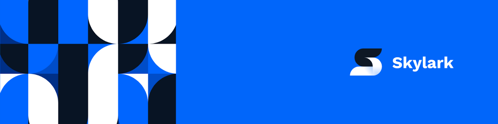

<!--  -->

[![Next][next.js]][next-url]
[![React][react.js]][react-url]
[![Tailwind CSS][tailwind-css]][tailwind-url]
[![GraphQL][graphql]][graphql-url]
[![Storybook][storybook]][storybook-url]
[![Vercel][vercel]][vercel-url]

[![MIT License][license-shield]][license-url]
[![codecov][codecov-badge]][codecov-url]
[![PRs Welcome][prs-welcome]][prs-welcome-url]

<!-- PROJECT LOGO -->
<br />
<div align="center">
  <a href="https://www.skylarkplatform.com/">
    
  </a>

  <h3 align="center">Skylark UI</h3>

  <p align="center">
    Curation UI for Skylark
    <br />
    <a href="https://www.skylarkplatform.com/"><strong>Learn more »</strong></a>
    <br />
    <br />
    <a href="https://app.skylarkplatform.io">View App</a>
    ·
    <a href="https://github.com/skylark-platform/skylark-ui/issues">Report Bug</a>
    ·
    <a href="https://github.com/skylark-platform/skylark-ui/issues">Request Feature</a>
  </p>
</div>

<!-- TABLE OF CONTENTS -->
<details>
  <summary>Table of Contents</summary>
  <ol>
    <li>
      <a href="#about-the-project">About The Project</a>
    </li>
    <li>
      <a href="#getting-started">Getting Started</a>
      <ul>
        <li><a href="#prerequisites">Prerequisites</a></li>
        <li><a href="#installation">Installation</a></li>
        <li><a href="#running">Running</a></li>
        <li><a href="#testing">Testing</a></li>
        <li><a href="#deploying">Deploying</a></li>
      </ul>
    </li>
    <li><a href="#contributing">Contributing</a></li>
    <li><a href="#license">License</a></li>
    <li><a href="#contact">Contact</a></li>
  </ol>
</details>

## About The Project

<!-- [![Product Name Screen Shot][product-screenshot]](https://example.com) -->

Skylark UI is the offical frontend app for Skylark. It provides a user interface that enables users to:

- Import, create, update objects
- Create relationships between objects
- Curate objects into sets
- Assign availability rules to determine which objects are returned
- Modify their Skylark configuration

We made the decision to Open Source the repository so that users are able to take the UI and modify it to fit their needs. This can be anywhere from adding their logo, to crafting new features that are currently missing. All we ask in return is that when you create these features, you raise a pull request so that other users can benefit too!

Additionally, all requests that are made to Skylark from the UI are using the official Skylark GraphQL API meaning you can use this repository as an aid when developing your own Skylark applications. If this sounds like you, you may also want to check out our [StreamTV application][saas-streamtv] - a demo Streaming App built on Skylark.

[StreamTV][saas-streamtv]: https://github.com/skylark-platform/reference-apps

---

<br />

## Getting Started

To set the code up locally for development, follow these steps:

### Prerequisites

- Yarn
  ```sh
   npm install -g yarn
  ```
- Vercel CLI
  ```sh
   npm install -g vercel@latest
  ```

### Installation

Install the NPM dependencies:

```bash
yarn
```

_This should also install the pre-commit hooks._

<br>

Next, you need to create a `.env` or `.env.local` file so you can to connect to your Skylark account.

There are two ways to do this:

#### 1. [Skylark Vercel team][skylark-vercel-url] member

We can use the [Vercel CLI][vercel-cli-url] to download environment variables straight from Vercel.

First, connect to the skylark-ui Vercel project

```bash
yarn vercel:link
```

Then we can pull the environment variables from Vercel:

```bash
yarn vercel:env
```

_Note: When you use this method, it is likely that the values will change each day. Due to this it is neccessary to re-run the env command each day._

#### 2. Connect to your Skylark

You can use the admin panel in your Skylark account to get the environment variables required to connect.

Coming soon...

### Running

To run the Next.js dev server:

```bash
yarn dev
```

To run Storybook:

```bash
yarn storybook
```

### Testing

#### Storybook (Component testing)

[Check out our Storybook][storybook-url]

We use this to compare diff on a pull request as well as test before they are merged.

#### Unit tests

We use Jest and React Testing Libary for unit testing. To run use:

```bash
yarn test
```

#### Integration tests

In the future we plan to use Cypress and Percy for Integration tests.

### Deploying

The easiest way to deploy the Skylark UI is using Vercel. Use the [Deploy button][vercel-deploy-button] below to automatically fork this project and create it in Vercel.

[](https://vercel.com/new/clone?repository-url=https%3A%2F%2Fgithub.com%2Fskylark-platform%2Fskylark-ui&env=NEXT_PUBLIC_SAAS_API_ENDPOINT,NEXT_PUBLIC_SAAS_API_KEY&project-name=skylark-ui&repository-name=skylark-ui)

Otherwise, as the app is built using Next.js, you can use their documentation to deploy to other platforms:

- [Next.js Deployment][nextjs-deploy-url]

## Contributing

Contributions are what make the open source community such an amazing place to learn, inspire, and create. Any contributions you make are **greatly appreciated**.

If you have a suggestion that would make this better, please fork the repo and create a pull request. You can also simply open an issue with the tag "enhancement".
Don't forget to give the project a star! Thanks again!

1. Fork the Project
2. Create your Feature Branch (`git checkout -b feature/AmazingFeature`)
3. Commit your Changes (`git commit -m 'Add some AmazingFeature'`)
4. Push to the Branch (`git push origin feature/AmazingFeature`)
5. Open a Pull Request

## License

Distributed under the MIT License. See `LICENSE` for more information.

## Contact

Skylark Support - support@skylarkplatform.com

Project Link: [https://github.com/skylark-platform/skylark-ui](https://github.com/skylark-platform/skylark-ui)

<!-- MARKDOWN LINKS & IMAGES -->
<!-- https://www.markdownguide.org/basic-syntax/#reference-style-links -->

[license-shield]: https://img.shields.io/github/license/othneildrew/Best-README-Template.svg?style=for-the-badge
[license-url]: https://github.com/othneildrew/Best-README-Template/blob/master/LICENSE.txt
[prs-welcome]: https://img.shields.io/badge/PRs-welcome-brightgreen.svg?style=for-the-badge
[prs-welcome-url]: http://makeapullrequest.com
[product-screenshot]: images/screenshot.png
[next.js]: https://img.shields.io/badge/next.js-000000?style=for-the-badge&logo=nextdotjs&logoColor=white
[next-url]: https://nextjs.org/
[react.js]: https://img.shields.io/badge/React-20232A?style=for-the-badge&logo=react&logoColor=61DAFB
[react-url]: https://reactjs.org/
[tailwind-css]: https://img.shields.io/badge/tailwindcss-%2338B2AC.svg?style=for-the-badge&logo=tailwind-css&logoColor=white
[tailwind-url]: https://tailwindcss.com/
[storybook]: https://img.shields.io/badge/-Storybook-FF4785?style=for-the-badge&logo=storybook&logoColor=white
[storybook-url]: https://storybook.app.skylarkplatform.io
[vercel]: https://img.shields.io/badge/vercel-%23000000.svg?style=for-the-badge&logo=vercel&logoColor=white
[vercel-url]: https://vercel.com/
[graphql]: https://img.shields.io/badge/-GraphQL-E10098?style=for-the-badge&logo=graphql&logoColor=white
[graphql-url]: https://graphql.org/
[codecov-badge]: https://img.shields.io/codecov/c/github/skylark-platform/skylark-ui?style=for-the-badge&token=G142TWXSJL
[codecov-url]: https://codecov.io/gh/skylark-platform/skylark-ui
[skylark-vercel-url]: https://vercel.com/skylark-platform
[vercel-cli-url]: https://vercel.com/docs/cli
[nextjs-deploy-url]: https://nextjs.org/docs/deployment
[vercel-deploy-button]: https://vercel.com/docs/deploy-button
[saas-streamtv]: https://saas.apps.skylark-dev.skylarkplatform.io/
